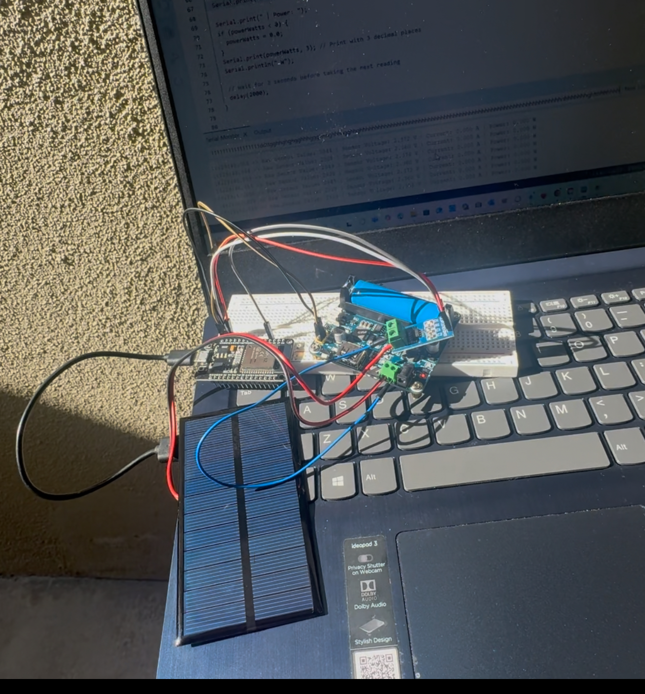

# Solar-Energy-System-with-Power-Monitoring
A portable 5V USB charging system that utilizes a 6V solar panel to charge a Li-ion battery. The system integrates an ESP32 and an ACS712 current sensor to provide real-time monitoring of the power generated by the solar panel.
Project Overview:
This project demonstrates a complete, off-grid renewable energy solution, combining principles of power electronics, embedded systems, and instrumentation. The core of the system is a Waveshare solar power management module that handles efficient battery charging (using MPPT) and provides a stable, boosted 5V output.

To add data analysis capabilities, an ESP32 microcontroller is used to read data from an ACS712 current sensor placed in-line with the solar panel. The ESP32 calculates the real-time current (Amps) and power (Watts) being generated, and prints this data to the serial monitor for analysis. This showcases a practical application of instrumentation in evaluating the performance of a renewable energy source.

Components Used
Power Management: Waveshare Solar Power Manager (14500 Version)

Energy Storage: 14500 3.7V Li-ion Battery

Energy Source: 6V, 3W Solar Panel

Monitoring System: ESP32 Development Board

Sensor: ACS712 Hall-Effect Current Sensor (5A Module)

Circuit & Wiring
The system is assembled in two main parts. First, the core solar charger is built using the Waveshare board, battery, and panel. Second, the monitoring circuit is added by placing the ACS712 sensor between the solar panel and the Waveshare board, with the sensor's output being read by the ESP32

Source Code
Below is the complete, commented C++ code for the ESP32 microcontroller.
/*
  Solar Energy System with Power Monitoring
  Author: Osazee Imasuen
  Date: August 20, 2025

  Description:
  This code runs on an ESP32 to monitor the power generated by a solar panel.
  It uses an ACS712 current sensor to measure the current flowing from the panel
  to a Waveshare solar management board. It then calculates the real-time power
  in Watts and prints the data to the Serial Monitor for analysis.
*/

// Define the GPIO pin connected to the ACS712's OUT pin
const int SENSOR_PIN = 34; // GPIO 34 is a good ADC (Analog-to-Digital Converter) pin

// --- CALIBRATION AND SETUP CONSTANTS ---

// The voltage of your solar panel.
const float PANEL_VOLTAGE = 6.0;

// The ESP32's ADC has a 12-bit resolution (0-4095) and reads up to 3.3V.
const float ADC_RESOLUTION = 4095.0;
const float VREF = 3.3;

// The ACS712 (5A version) has a sensitivity of 185mV per Amp (0.185V/A).
// It outputs 2.5V when there is 0A of current.
const float SENSOR_SENSITIVITY = 0.185;
const float ZERO_CURRENT_VOLTAGE = 2.5;

void setup() {
  // Start the Serial Monitor for debugging and data display
  Serial.begin(115200);
  Serial.println("Solar Energy Monitor Initializing...");
  delay(1000); // Wait for system to stabilize
}

void loop() {
  // Read the raw analog value from the sensor (0-4095)
  int rawValue = analogRead(SENSOR_PIN);
 
  // Convert the raw ADC value to a voltage reading
  float sensorVoltage = (rawValue / ADC_RESOLUTION) * VREF;

  // Convert the sensor's voltage reading into a current value in Amps
  // We subtract the 2.5V offset and then divide by the sensor's sensitivity
  float currentAmps = (sensorVoltage - ZERO_CURRENT_VOLTAGE) / SENSOR_SENSITIVITY;

  // Calculate the power in Watts (P = V * I)
  float powerWatts = PANEL_VOLTAGE * currentAmps;

  // --- Display the Data ---
  // Print a clean, formatted output to the Serial Monitor.
 
  Serial.print("Raw Sensor Value: ");
  Serial.print(rawValue);
 
  Serial.print(" | Sensor Voltage: ");
  Serial.print(sensorVoltage, 3); // Print with 3 decimal places
  Serial.print(" V");

  Serial.print(" | Current: ");
  // To prevent small negative readings due to sensor noise when there's no sun
  if (currentAmps < 0) {
    currentAmps = 0.0;
  }
  Serial.print(currentAmps, 3); // Print with 3 decimal places
  Serial.print(" A");

  Serial.print(" | Power: ");
  if (powerWatts < 0) {
    powerWatts = 0.0;
  }
  Serial.print(powerWatts, 3); // Print with 3 decimal places
  Serial.println(" W");

  // Wait for 2 seconds before taking the next reading
  delay(2000);
}

